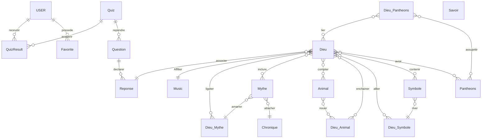

```mermaid
erDiagram
    USER
    USER ||--o{ Favorite : possede
    USER ||--o{ QuizResult : recevoir
    Quiz ||--o{ Question : repondre
    Quiz ||--o{ QuizResult : acquerir
    Question ||--o{ Reponse : declarer
    Dieu }o--o{ Pantheons : avoir
    Dieu_Pantheons }o--o{ Pantheons : assujettir
    Dieu_Pantheons }o--o{ Dieu : lier
    Dieu }o--o{ Symbole : contenir
    Dieu }o--o{ Dieu_Symbole : allier
    Symbole }o--|| Dieu_Symbole : river
    Dieu }o--o{ Dieu_Animal : enchainer
    Animal }o--o{ Dieu_Animal : nouer
    Dieu }o--o{ Animal : compter
    Dieu }o--o{ Mythe : inclure
    Dieu }o--o{ Dieu_Mythe : ligoter
    Dieu ||--|| Music : Affilier
    Dieu }o--|| Reponse : associer
    Mythe }o--|| Chronique : attacher
    Mythe }o--|| Dieu_Mythe : amarrer
    Savoir

```
