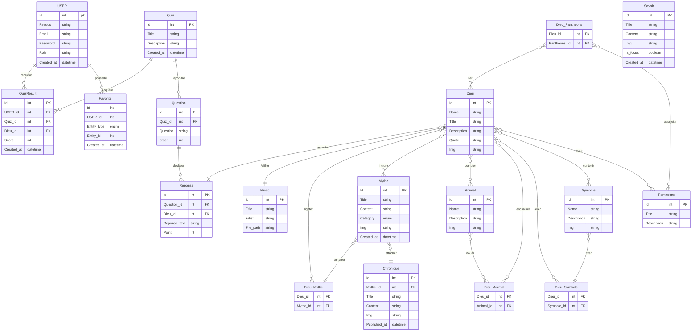

```mermaid
erDiagram
    USER
    USER ||--o{ Favorite : possede
    USER ||--o{ QuizResult : recevoir
    Quiz ||--o{ Question : repondre
    Quiz ||--o{ QuizResult : acquerir
    Question ||--o{ Reponse : declarer
    Dieu }o--o{ Pantheons : avoir
    Dieu_Pantheons }o--o{ Pantheons : assujettir
    Dieu_Pantheons }o--o{ Dieu : lier
    Dieu }o--o{ Symbole : contenir
    Dieu }o--o{ Dieu_Symbole : allier
    Symbole }o--|| Dieu_Symbole : river
    Dieu }o--o{ Dieu_Animal : enchainer
    Animal }o--o{ Dieu_Animal : nouer
    Dieu }o--o{ Animal : compter
    Dieu }o--o{ Mythe : inclure
    Dieu }o--o{ Dieu_Mythe : ligoter
    Dieu ||--|| Music : Affilier
    Dieu }o--|| Reponse : associer
    Mythe }o--|| Chronique : attacher
    Mythe }o--|| Dieu_Mythe : amarrer
    Savoir

USER{
    Id int pk
    Pseudo string
    Email string
    Password string
    Role string
    Created_at datetime
}

Favorite{
    Id int
    USER_id int
    Entity_type enum
    Entity_id int
    Created_at datetime
}

QuizResult{
    Id int PK
    USER_id int FK
    Quiz_id int FK
    Dieu_id int FK
    Score int
    Created_at datetime
}

Reponse{
    Id int PK
    Question_id int FK
    Dieu_id int FK
    Reponse_text string
    Point int
}

Question{
    Id int PK
    Quiz_id int FK
    Question string
    order int
}

Quiz{
    Id int PK
    Title string
    Description string
    Created_at datetime
}

Dieu{
    Id int PK
    Name string
    Title string
    Description string
    Quote string
    Img string
}

Dieu_Pantheons{
    Dieu_id int FK
    Pantheons_id int FK
}

Pantheons{
    Id int PK
    Title string
    Description string
}

Music{
    Id int PK
    Title string
    Artist string
    File_path string
}

Dieu_Mythe{
    Dieu_id int FK
    Mythe_id int Fk
}

Mythe{
    Id int PK
    Title string
    Content string
    Category enum
    Img string
    Created_at datetime
}

Dieu_Symbole{
    Dieu_id int FK
    Symbole_id int FK
}

Symbole{
    Id int PK
    Name string
    Description string
    Img string
}

Dieu_Animal{
    Dieu_id int FK
    Animal_id int FK
}

Animal{
    Id int PK
    Name string
    Description string
    Img string
}

Chronique{
    Id int PK
    Mythe_id int FK
    Title string
    Content string
    Img string
    Published_at datetime
}

Savoir{
    Id int PK
    Title string
    Content string
    Img string
    Is_focus boolean
    Created_at datetime
}
```
